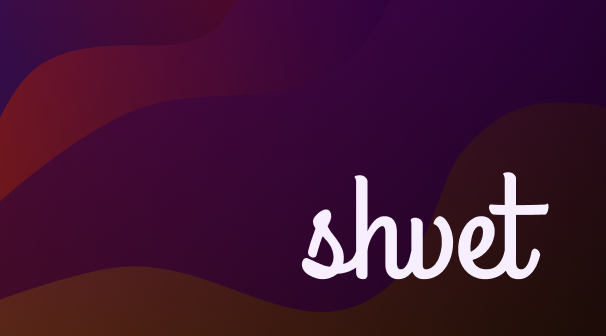

background image source [deviantart/leikoi](https://www.deviantart.com/leikoi/art/The-Neon-Shallows-823330548)

An application for changing HSV values of images.

## Available Themes

+ dracula
+ gruvbox
+ nord
+ solarized
+ tokyonight

NOTE: if the theme you like isn't shown here. Adding a theme to Shvet is really eazy, for more info [see here](https://example.com).

## Installation

There are two ways to install this application on your device:
+ Download precompiled binary
+ Build from source on your local PC

### Download

Click here to [download](https://example.com) the application

### Build from source

```
git clone https://github.com/sz47/shvet.git            # clone this repo
cd shvet                                               # goto the shvet directory
GOOS=linux CGO_ENABLED=0 go build -o shvet main.go     # replace linux with your target OS
```

## Usage

Note: The time can vary vastly upon the resolution of image and flags provided. Also currently time optimization isn't the focus, rather the output image is prioritized, will focus on optimizations once we achive 'good' results, but contributions are always welcomed :)

```
        $ shvet <theme> path/to/image.png
example $ shvet gruvbox ~/Wallpapers/linux.png
```

You can also force color replacement in image which will result in a image as shown in the image at the top of README
```
        $ shvet force <theme> path/to/image.png
example $ shvet force gruvbox ~/Wallpapers/linux.png
```

For list of themes supported do `shvet list`

For help: `shvet help`
